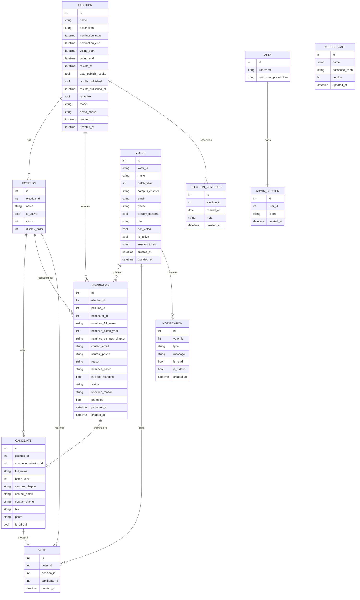

# ERD for HCAD Alumni Voting System (clean mermaid syntax)

Notes:
- Simplified to pure Mermaid syntax (no PK/UNIQUE tags); relationships carry cardinality.
- If your preview still caches the old block, close and reopen the preview tab.
